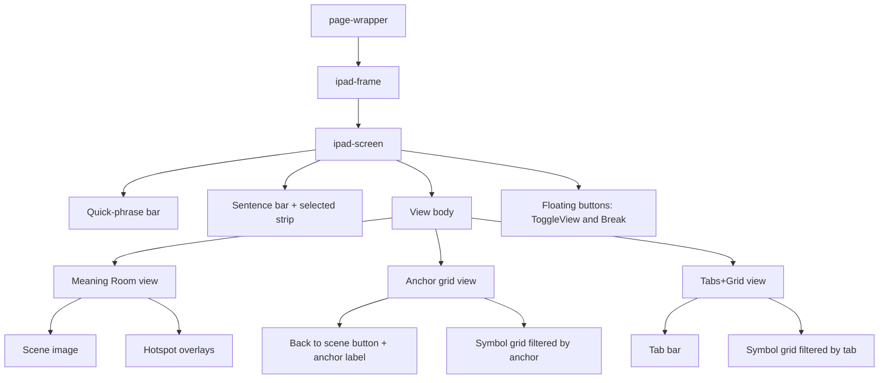
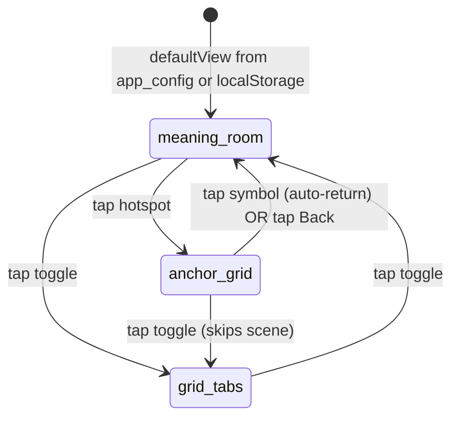
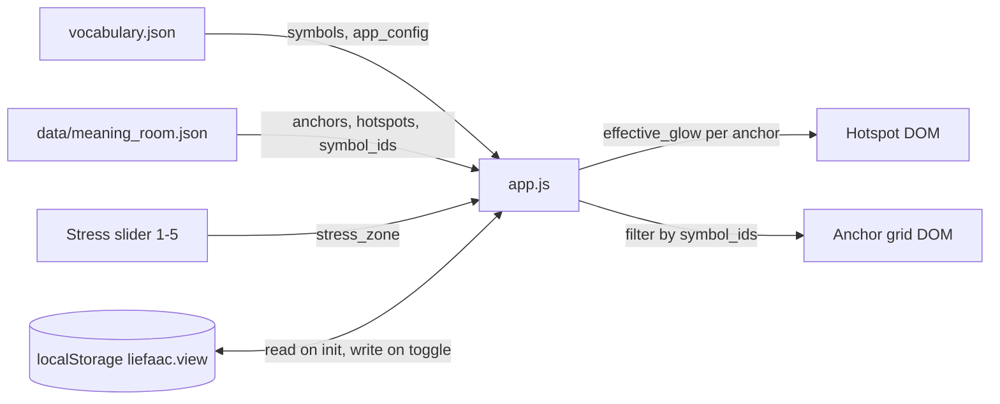

# Meaning Room — Design Spec

> **Status:** Draft for review
> **Date:** 2026-05-14
> **Source brainstorm:** `docs/AMIGA_AAC_MeaningRoom.md`, `docs/AMIGA_AAC_Vocab_Collision_Analysis.md`
> **Workflow:** superpowers `brainstorming` → `writing-plans` → `executing-plans`

---

## 1. Goal

Add a Meaning Room view to the LiefAAC demo as a second navigation surface alongside the current Tabs+Grid. The user (a non-literate child with autism) sees a single persistent illustrated scene; tapping an anchor object opens that anchor's vocabulary as a bounded symbol grid. The scene is the spatial index. Glow indicates touchability and ramps up under simulated stress.

This spec covers **Tier 1 MVP + glow** from the meeting doc. Drag/combine, relational arrows, auto-collapse-to-simplified, and the affect-as-Bayesian-prior layer are explicitly deferred.

---

## 2. Scope

### In scope (this iteration)

- Two top-level views: **Meaning Room** and **Tabs+Grid**, switchable at any time via an always-visible toggle
- Meaning Room renders `[assets/images/meaning_room_v0.png](../../../assets/images/meaning_room_v0.png)` with absolutely-positioned hotspot buttons over each anchor object
- Each hotspot has a soft glow whose intensity is a function of (a) the anchor's per-anchor weight curve, (b) the current simulated-stress zone (1-5 from the slider)
- Tapping an anchor opens an **anchor grid view** containing only the symbols mapped to that anchor; the grid reuses the existing `.symbol-card` rendering with no tab bar
- Tapping a symbol in the anchor grid adds it to the sentence (current behavior) and **auto-returns to the scene** for the next selection. An always-visible **← Back to scene** button allows browsing without selecting.
- Default view + view-toggle visibility configurable via `vocabulary.json` `app_config` block; user toggle persisted in `localStorage`
- Anchor list, hotspot rectangles, and anchor→symbol mappings all live in **one config file**: `[data/meaning_room.json](../../../data/meaning_room.json)`. No edits to existing symbol records in `vocabulary.json`.
- Layout reflow: tabs move from above the sentence builder to immediately above the symbol grid (within Tabs+Grid view only). Quick-phrase bar stays above the sentence builder. Break button stays always-visible.

### Out of scope (deferred)

- Promoting `meaning_room_zone` to a per-symbol field in `vocabulary.json` — defer until SLP review of the anchor-config converges
- Drag-to-combine, relational gesture between Self and Other, Cognition anchor (no anchor in v0 image)
- Auto-trigger of "simplified mode" from high arousal
- Bayesian-prior affect layer over communicative-intent categories
- Image regeneration is **planned** in this spec (prompt + dimensions defined) but actually swapping images is a follow-up task gated on a satisfactory v1 generation

---

## 3. Architecture

### 3.1 Component tree




### 3.2 View state machine




The toggle button always switches between the two top-level views (`meaning_room` and `grid_tabs`). The "back to scene" button is internal to the Meaning Room view and only collapses the anchor-grid sub-state.

### 3.3 Data flow




---

## 4. Layout

Top-to-bottom order inside `.ipad-screen`, applies to BOTH top-level views:

1. **Quick-phrase bar** (existing, unchanged) — always visible
2. **Sentence bar** (existing, unchanged) — speak/clear controls + predicted sentence
3. **Selected symbols strip** (existing, unchanged) — only visible when symbols are selected
4. **View body** — exactly one of:
  - Meaning Room (scene + hotspots), OR
  - Anchor grid (back button row + symbols), OR
  - Tabs+Grid (tab bar + symbols)
5. **Floating buttons** — Break (bottom-right, existing) + View Toggle (bottom-left, new)

**Change vs. current layout:** the tab bar moves OUT of the always-visible chrome and INTO the Tabs+Grid body. In Meaning Room view there is no tab bar. This honors the user's stated rule "we will want to move the tabs down to the grid and have the sentence builder above them."

---

## 5. Data model

### 5.1 `vocabulary.json` additions

A single `app_config` block at the top level:

```json
{
  "meta": { ... },
  "app_config": {
    "default_view": "meaning_room",
    "show_view_toggle": true,
    "auto_return_to_scene_ms": 0
  },
  "tabs": [ ... ],
  ...
}
```


| Field                     | Type                           | Default          | Purpose                                                                                                                                                          |
| ------------------------- | ------------------------------ | ---------------- | ---------------------------------------------------------------------------------------------------------------------------------------------------------------- |
| `default_view`            | `"meaning_room" | "grid_tabs"` | `"meaning_room"` | First-load view when `localStorage` has no preference                                                                                                            |
| `show_view_toggle`        | `boolean`                      | `true`           | If `false`, the toggle button is hidden — locks the user to `default_view`. Useful for SLP-controlled deployments.                                               |
| `auto_return_to_scene_ms` | `number`                       | `0`              | Delay before auto-returning to scene after a symbol tap in anchor-grid. `0` = immediate. SLPs can raise it (e.g. 600ms) to give the child a confirmation moment. |


### 5.2 `data/meaning_room.json` schema

```json
{
  "image": "assets/images/meaning_room_v0.png",
  "image_natural_size": [1402, 1122],
  "default_glow_intensity": 0.35,
  "stress_glow_curve_default": [0.30, 0.35, 0.45, 0.55, 0.70],
  "anchors": [
    {
      "id": "self",
      "label": "Me",
      "hotspot": { "x": 0.32, "y": 0.18, "w": 0.18, "h": 0.62 },
      "symbol_ids": ["i", "me", "my", "mine"],
      "stress_glow_curve": null
    },
    {
      "id": "actions",
      "label": "Actions",
      "icon": "⚡",
      "hotspot": { "x": 0.22, "y": 0.70, "w": 0.14, "h": 0.14 },
      "symbol_ids": ["want", "need", "like", "do", "make", "open", "close", "put", "take", "see", "feel", "turn", "work", "know", "eat", "drink", "play", "go", "walk", "help", "hug", "jump", "run", "push", "read", "sleep", "more", "all_done", "good", "yes", "want_help", "want_item", "i_like_this"],
      "stress_glow_curve": null
    },
    {
      "id": "calm_corner",
      "label": "Calm",
      "hotspot": { "x": 0.55, "y": 0.27, "w": 0.13, "h": 0.22 },
      "symbol_ids": ["i_need_a_break", "break", "space", "sleep", "help", "help_me", "i_need_help", "too_loud", "too_loud_i_need_a_break", "help_me_im_frustrated"],
      "stress_glow_curve": [0.30, 0.45, 0.65, 0.85, 1.00]
    }
  ]
}
```

Field reference:


| Field                         | Type              | Notes                                                                                                                                                                                                       |
| ----------------------------- | ----------------- | ----------------------------------------------------------------------------------------------------------------------------------------------------------------------------------------------------------- |
| `image`                       | string            | Path relative to repo root                                                                                                                                                                                  |
| `image_natural_size`          | `[width, height]` | Used only for documentation/aspect-ratio sanity. Hotspots are normalized so they survive image swaps with the same composition.                                                                             |
| `default_glow_intensity`      | `0.0-1.0`         | Baseline glow when no stress signal is available                                                                                                                                                            |
| `stress_glow_curve_default`   | `[5]`             | Default curve indexed by `stress_zone - 1` (zones 1-5). Used for any anchor whose own `stress_glow_curve` is `null`.                                                                                        |
| `anchors[].id`                | string            | Stable identifier (e.g. `"self"`, `"food_drink"`)                                                                                                                                                           |
| `anchors[].label`             | string            | Optional aria-label / on-tap heading text in the anchor-grid header                                                                                                                                         |
| `anchors[].icon`              | `string | null`   | Optional emoji/icon rendered as a programmatic overlay on the hotspot (used when no drawn element exists in the scene image, e.g. the Actions ⚡ in v0). `null` = hotspot is invisible over a drawn element. |
| `anchors[].hotspot`           | `{x,y,w,h}`       | All values 0.0-1.0 in normalized image coords. Origin top-left.                                                                                                                                             |
| `anchors[].symbol_ids`        | `string[]`        | Existing symbol IDs from `vocabulary.json`. Display order = array order.                                                                                                                                    |
| `anchors[].stress_glow_curve` | `[5] | null`      | Per-anchor override of `stress_glow_curve_default`. Allows the calm/stop anchors to ramp faster under stress than the colors anchor.                                                                        |


### 5.3 Effective glow formula

```
effective_glow(anchor, stress_zone) =
    (anchor.stress_glow_curve ?? config.stress_glow_curve_default)[stress_zone - 1]
```

A single CSS variable `--glow` (0.0-1.0) is set per hotspot DOM node; CSS scales `box-shadow` blur radius and color alpha from this variable.

---

## 6. Initial anchor seed (v1, derived from v0 image)

Eleven anchors, mapped to symbols already live in `vocabulary.json` (no new symbols required for any anchor; counts in parentheses verified via vocabulary scan):


| Anchor `id`          | Label   | Visible in v0                                                            | Seeded `symbol_ids` (count)                                                                                                                                                                                                                                               | Notes                                                                                                                                                                                     |
| -------------------- | ------- | ------------------------------------------------------------------------ | ------------------------------------------------------------------------------------------------------------------------------------------------------------------------------------------------------------------------------------------------------------------------- | ----------------------------------------------------------------------------------------------------------------------------------------------------------------------------------------- |
| `self`               | Me      | Glowing child figure                                                     | `i, me, my, mine` (4)                                                                                                                                                                                                                                                     | Center anchor                                                                                                                                                                             |
| `actions`            | Actions | Overlay icon ⚡ (no dedicated v0 element; placed near speech-bubble area) | `want, need, like, do, make, open, close, put, take, see, feel, turn, work, know, want_help, want_item, i_like_this, more, all_done, good, yes` + context verbs duplicated from other anchors: `eat, drink, play, go, walk, help, hug, jump, run, push, read, sleep` (33) | **Key sentence-building anchor.** Uses ⚡ icon matching existing Actions tab. Context-specific verbs are duplicated here AND in their contextual anchors so kids find them in both places. |
| `other_people`       | People  | Right-side silhouettes                                                   | `you, mom, dad, them, their, your` (6)                                                                                                                                                                                                                                    | Drop `mommy` / `we` (not live)                                                                                                                                                            |
| `time`               | Time    | Wall clock                                                               | `one_more_minute` (1)                                                                                                                                                                                                                                                     | **Sparse — flagged for SLP review.** Validates that anchor config exposes vocab gaps.                                                                                                     |
| `stop_refusal`       | Stop    | Red STOP hand                                                            | `stop, no, not, cant, wont, i_dont_want_that, no_i_dont_want_that` (7)                                                                                                                                                                                                    |                                                                                                                                                                                           |
| `outside`            | Outside | Window with hills                                                        | `go, home, walk, playground, gym, classroom` (6)                                                                                                                                                                                                                          | `go`, `walk` also in Actions                                                                                                                                                              |
| `calm_corner`        | Calm    | Bean bag                                                                 | `i_need_a_break, break, space, sleep, help, help_me, i_need_help, too_loud, too_loud_i_need_a_break, help_me_im_frustrated` (10)                                                                                                                                          | High-stress glow ramp. `sleep`, `help` also in Actions                                                                                                                                    |
| `toys`               | Toys    | Open toy box                                                             | `toy, play, balloon, puzzle, play_doh, doll, bubbles, game, music, ipad, books, read, car, train, boat, airplane, bus, slide, spin, squeeze, swing, tickle, ticklesqueeze, jump, run, push, hug` (27)                                                                     | Activity verbs interspersed. `play`, `jump`, `run`, `push`, `read`, `hug` also in Actions                                                                                                 |
| `food_drink`         | Food    | Table with apple/cookie/water                                            | `water, juice, fruit, cookie, candy, popcorn, pretzel, rice, carrot, chips, eat, drink, i_want_water, i_want_food, i_want_apple` (15)                                                                                                                                     | `eat`, `drink` also in Actions                                                                                                                                                            |
| `clothing`           | Clothes | Coat hooks                                                               | `shirt, jacket, i_want_a_jacket, coat, hat, pants, shoe, sock` (8)                                                                                                                                                                                                        |                                                                                                                                                                                           |
| `colors_descriptors` | Colors  | Paint swatches above window                                              | `red, orange, yellow, green, blue, purple, pink, black, white, big, little, fast, slow, happy, sad, mad, tired, sick, frustrated, nervous` (20)                                                                                                                           | Combines colors + descriptors since both are "describe-words" in v0                                                                                                                       |


**Verb duplication principle:** Context-specific verbs (e.g. `eat`, `play`, `go`) appear in BOTH their contextual anchor AND the Actions anchor. This means a child who thinks "eat" when looking at food finds it there, while a child building a sentence who needs a verb finds it in Actions. The `symbol_ids` arrays in `data/meaning_room.json` simply list the same symbol ID in multiple anchors — no data model change needed.

Hotspot rectangles will be eyeballed against `meaning_room_v0.png` during Task 3 of the implementation plan and committed into `data/meaning_room.json`. Each rectangle is normalized `[0..1]` so it survives image swaps. The Actions anchor hotspot is placed as a programmatic overlay (⚡ icon with label) rather than mapping to a drawn element in v0; the v1 image regen prompt (§11) includes a dedicated visual element for it.

**Deliberate omissions in v1 anchor set** (vs. doc's 9 canonical anchors):

- **Body** — no body anchor in v0 image; the child figure carries it. Defer until v1 image regen with explicit body-zone marker.
- **Cognition** — no thought-bubble in v0. Defer.
- **Relationships (arrow)** — gestural; Tier 3, deferred.

These deferrals are noted in `data/meaning_room.json` via a top-level `deferred_anchors` array (documentation-only) so SLPs see what's intentionally missing.

---

## 7. Hotspot rendering

### 7.1 DOM structure

```html
<div class="meaning-room-view" id="meaningRoomView">
  <div class="meaning-room-stage">
    
    <button class="mr-hotspot" data-anchor-id="self"
            style="left:32%;top:18%;width:18%;height:62%;--glow:0.35"
            aria-label="Me"></button>
    <!-- ... one per anchor ... -->
  </div>
</div>
```

The `.meaning-room-stage` is `position: relative` and sized to fit the body area while preserving the image's aspect ratio (`aspect-ratio: <w> / <h>` from `image_natural_size`). All hotspots are `position: absolute` with percent coordinates → scales correctly at any container width.

### 7.2 Glow CSS

```css
.mr-hotspot {
  position: absolute;
  background: transparent;
  border: 0;
  border-radius: 12px;
  cursor: pointer;
  transition: box-shadow 0.3s ease, background 0.15s ease;
  box-shadow:
    0 0 calc(12px * var(--glow, 0.35)) calc(2px * var(--glow, 0.35))
      rgba(255, 220, 120, calc(0.55 * var(--glow, 0.35))),
    inset 0 0 calc(20px * var(--glow, 0.35))
      rgba(255, 220, 120, calc(0.30 * var(--glow, 0.35)));
}
.mr-hotspot:hover,
.mr-hotspot:focus-visible {
  background: rgba(255, 220, 120, 0.10);
  box-shadow:
    0 0 24px 6px rgba(255, 220, 120, 0.65),
    inset 0 0 28px rgba(255, 220, 120, 0.45);
  outline: none;
}
.mr-hotspot:active { transform: scale(0.97); }
```

### 7.3 Stress → glow update

The existing `mockValenceSlider` `input` handler calls a new `updateMeaningRoomGlow()` that walks each `.mr-hotspot` and writes `--glow = effective_glow(anchor, stress_zone)`. Cheap (≤10 nodes), runs on every slider change.

---

## 8. Anchor grid view

When a hotspot is tapped:

1. Set view state to `anchor_grid` with the tapped anchor.
2. Render header strip: `← Back to scene` button + anchor label (e.g. "TOYS").
3. Render the symbol grid using existing `.symbol-card` rendering, filtered to `anchor.symbol_ids` in array order.
4. The Fitzgerald POS color tints + suggestion highlights still apply (cards reuse the same code path).

When a symbol is tapped in the anchor grid:

- Existing `handleSymbolTap()` runs (adds to `selectedSymbols`, updates prediction, etc.)
- After `app_config.auto_return_to_scene_ms` (default `0`), view returns to `meaning_room` (scene with hotspots).

When `← Back to scene` is tapped:

- View returns to `meaning_room` immediately, no symbol added.

This satisfies the user's explicit decision: **"tapping a symbol adds it to the sentence and returns to scene automatically (one-tap-per-word, browse via back button)."**

---

## 9. View toggle + persistence

A single floating button styled as a mirror of `.btn-break`, positioned bottom-LEFT inside `.ipad-screen`:

```
[ 🏠 Room ]  ←→  [ ▦ Grid ]
```

Label and icon swap based on the *destination* view (button always says "go to the other view").

Persistence:

```js
const STORAGE_KEY = 'liefaac.view';
function loadInitialView() {
  return localStorage.getItem(STORAGE_KEY)
    ?? VOCAB.app_config?.default_view
    ?? 'meaning_room';
}
function setView(view) {
  currentView = view;
  localStorage.setItem(STORAGE_KEY, view);
  renderViewBody();
  renderViewToggleButton();
}
```

If `app_config.show_view_toggle === false`, the button is not rendered and the user is locked to `default_view`. This is the SLP-deployment lock.

---

## 10. iPad target dimensions

- iPad portrait CSS: 768×1024. iPad landscape CSS: 1024×768.
- Current `.ipad-screen` (in our demo's iframe): `max-width: 828px`, `max-height: 80vh`, `min-height: 520px`.
- The Meaning Room view body, after subtracting the quick-phrase bar (~~52px), sentence bar (~~52px), selected strip (~~36px when present), and floating button reserved space (~~24px), gets roughly **480-600px of vertical space** at typical desktop sizes; narrower on actual iPad portrait.
- Target image aspect ratio: **5:4 (1.25)** to roughly match the v0 image (1402×1122 ≈ 1.25). This fits well into the available body box on iPad portrait when the body is ~700px wide × ~560px tall.
- For the regenerated v1 image we target natural size **1600×1280** (5:4, retina-friendly, file size manageable as PNG/JPEG ~1-2 MB).

The `aspect-ratio` CSS property on `.meaning-room-stage` keeps the stage box exactly at `1600/1280 = 1.25` so hotspot percentages remain perfectly aligned at any rendered size.

---

## 11. Refined image-generation prompt (v1)

For the follow-up regen task. Builds on the prompt in `[docs/AMIGA_AAC_MeaningRoom.md](../../AMIGA_AAC_MeaningRoom.md)` §"Image Generation Prompt", with these explicit changes for hotspot-friendliness:

> A warm, cozy child's therapy room illustrated in soft watercolor and gentle gouache style, viewed from a slight 3/4 isometric angle. Composed with **clear spatial separation** between eleven distinct anchor zones so each can be cleanly tapped without overlap. **Aspect ratio 5:4 (1600×1280).**
>
> **Center**: a friendly, gender-neutral, racially-ambiguous child figure standing on a round rug, with a soft golden glow radiating from their chest and face. The figure occupies a tall vertical column in the center-left of the frame.
>
> **Anchor zones (with required spatial separation):**
>
> - **Upper-left**: a round analog clock on the wall (Time anchor) AND a small bold red STOP hand sign clearly separated below the clock (Stop/Refusal anchor).
> - **Left wall**: wooden coat hooks holding a jacket, hat, and shoes (Clothing anchor).
> - **Lower-left**: an open colorful toy box overflowing with a balloon, a toy car, puzzle pieces, and a small radio/speaker (Toys/Preferred Items anchor).
> - **Center-left, near the child's feet or on the rug**: a small glowing lightning-bolt or starburst icon on the floor or rug edge — simple, bold, and distinct from the child figure (Actions anchor). Should feel like a "do" button embedded in the scene.
> - **Right side**: two soft silhouettes — one parent-sized, one child-sized — clearly separated from the central child (Other People anchor).
> - **Lower-right**: a low wooden table with a glass of water, an apple, and a cookie (Food/Drink anchor).
> - **Upper-right**: a bright window looking onto rolling green hills and a warm sun (Outside/Environment anchor).
> - **Mid-right between window and silhouettes**: a soft bean bag with a small potted plant nearby (Calm/Regulation anchor).
> - **Top edge above window**: six color paint swatches in a horizontal row — red, orange, yellow, green, blue, purple (Colors/Descriptors anchor).
>
> Soft afternoon light, muted warm palette, non-clinical. **Absolutely NO text labels or speech bubbles in the image** (labels are added programmatically). Style: Pixar concept art meets Montessori classroom illustration.

**Validation criteria for an acceptable v1 image:**

- All eleven anchor zones are present and visually distinct
- Each zone fits inside an axis-aligned rectangle with no overlap with another anchor's rectangle
- No embedded text
- Child figure is gender/race-neutral
- Image fits 5:4 at 1600×1280 with reasonable file size (<2MB after compression)

The actual regeneration is a follow-up task and gated on a satisfactory generation.

---

## 12. Verification approach

This codebase has no test framework (vanilla browser ES modules). The implementation plan will use **manual browser verification** with explicit per-task acceptance checks instead of automated tests. Each task ends with:

1. **Open `http://localhost:8000`** (after `python3 -m http.server`)
2. **Concrete behavioral checks** (e.g. "click the toggle button → the room image disappears and the tab bar appears above the symbol grid")
3. **Browser console check** (no errors)
4. **Visual snapshot if relevant** (e.g. screenshot the room with the slider at zone 5 — calm anchor should glow noticeably brighter than colors anchor)

A future iteration can add a Playwright smoke test if desired; not in scope here.

---

## 13. Exit criteria

The build is complete when:

1. App loads with Meaning Room as the default view (per `app_config.default_view`)
2. The room image renders with all eleven anchor hotspots visible (subtle glow at rest; the Actions anchor is a programmatic ⚡ overlay in v0)
3. Sliding the stress simulator from zone 1 to zone 5 visibly increases glow on the `calm_corner` and `stop_refusal` anchors more than on `colors_descriptors` (per the per-anchor curves)
4. Tapping any anchor opens an anchor-grid view containing the seeded symbols, with a "← Back to scene" button visible
5. Tapping a symbol in an anchor grid adds it to the sentence and returns the user to the room scene (with no delay since `auto_return_to_scene_ms` defaults to `0`)
6. The view-toggle button switches between Meaning Room and Tabs+Grid; the choice persists across page reloads via `localStorage`
7. Setting `vocabulary.json` `app_config.default_view` to `"grid_tabs"` and clearing `localStorage` results in Tabs+Grid being the first-load view
8. In Tabs+Grid view, the tab bar is rendered immediately above the symbol grid (not above the sentence builder); existing tabs/grid functionality is unchanged
9. Break button remains accessible from every view/sub-state
10. No console errors, no broken existing functionality (quick-phrase bar, sentence prediction, breathing modal, Lief affect widget all still work)

---

## 14. Open questions for SLP review (do not block this build)

These do not block the build but should be raised with Joannalyn / Gabby / Emily after the prototype is usable:

- Is "Stop" deserving of its own scene anchor, or should it merge with the Calm anchor as a regulation cluster?
- Is "Time" worth a scene anchor when only one time-vocabulary symbol (`one_more_minute`) is currently live? Suggests time-vocabulary expansion is a vocab prerequisite.
- Should "Colors" and "Descriptors" share the paint-swatch anchor, or should descriptors live elsewhere (e.g. as a modifier overlay on whatever anchor the child is using)?
- Is auto-return-to-scene the right default, or do clinicians want symbol-multi-select-then-back behavior? `auto_return_to_scene_ms` makes both reachable via config.
- For the v1 image: should the child figure be a more abstract silhouette (per the doc's note "silhouette / abstract preferred") or remain illustrated like v0?

---

## 15. File touch list (for plan reference)


| File                                                                              | Action    | Purpose                                                                                                                                      |
| --------------------------------------------------------------------------------- | --------- | -------------------------------------------------------------------------------------------------------------------------------------------- |
| `[vocabulary.json](../../../vocabulary.json)`                                     | Modify    | Add `app_config` block                                                                                                                       |
| `[data/meaning_room.json](../../../data/meaning_room.json)`                       | Create    | Anchor definitions, hotspots, symbol mappings                                                                                                |
| `[index.html](../../../index.html)`                                               | Modify    | Reflow body region, add Meaning Room container, add toggle button, move tab bar inside Tabs+Grid view                                        |
| `[style.css](../../../style.css)`                                                 | Modify    | Meaning Room view styles, hotspot styles + glow vars, anchor-grid header, toggle button mirror of `.btn-break`                               |
| `[app.js](../../../app.js)`                                                       | Modify    | Load `meaning_room.json`, view-state machine, hotspot rendering + glow updates, anchor-grid render, toggle handler, localStorage persistence |
| `[assets/images/meaning_room_v0.png](../../../assets/images/meaning_room_v0.png)` | Use as-is | v1 image is a follow-up task                                                                                                                 |


---

*End of spec. Next step: `superpowers:writing-plans` to produce the task-by-task implementation plan at `docs/superpowers/plans/2026-05-14-meaning-room.md`.*